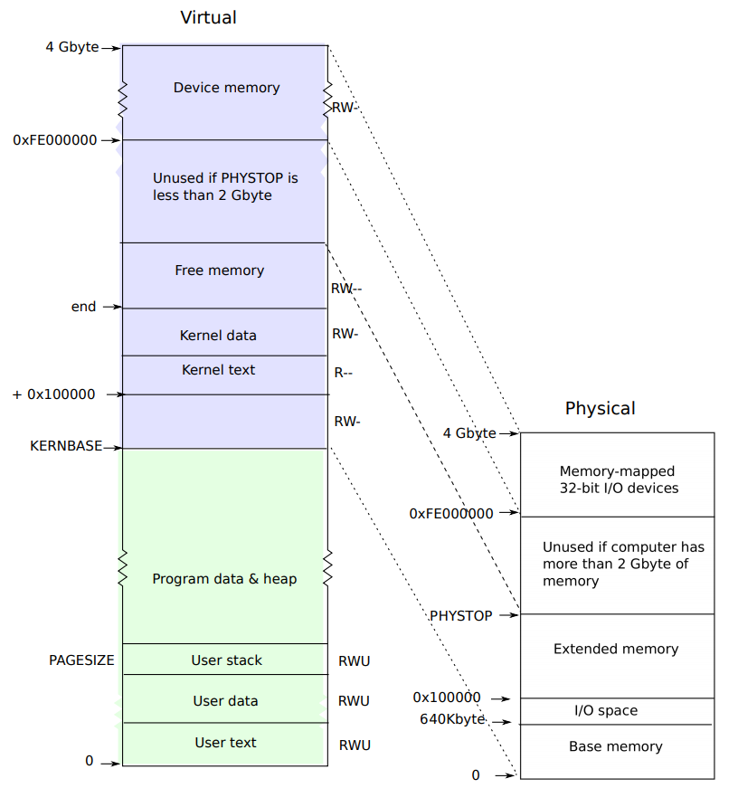

# MIT 6.828 Lab 2 实验笔记

## Part 1 : Physical Page Management

The first component is a physical memory allocator for the kernel, so that the kernel can allocate memory and later free it. Your allocator will operate in units of 4096 bytes, called *pages*. Your task will be to maintain data structures that record which physical pages are free and which are allocated, and how many processes are sharing each allocated page. You will also write the routines to allocate and free pages of memory.

Before starting up, there are some terminologies need to be clarified:

``` c
// A linear address 'la' has a three-part structure as follows:
//
// +--------10------+-------10-------+---------12----------+
// | Page Directory |   Page Table   | Offset within Page  |
// |      Index     |      Index     |                     |
// +----------------+----------------+---------------------+
//  \--- PDX(la) --/ \--- PTX(la) --/ \---- PGOFF(la) ----/
//  \---------- PGNUM(la) ----------/
//
// The PDX, PTX, PGOFF, and PGNUM macros decompose linear addresses as shown.
// To construct a linear address la from PDX(la), PTX(la), and PGOFF(la),
// use PGADDR(PDX(la), PTX(la), PGOFF(la)).


/*
 * Virtual memory map:                                Permissions
 *                                                    kernel/user
 *
 *    4 Gig -------->  +------------------------------+
 *                     |                              | RW/--
 *                     ~~~~~~~~~~~~~~~~~~~~~~~~~~~~~~~~
 *                     :              .               :
 *                     :              .               :
 *                     :              .               :
 *                     |~~~~~~~~~~~~~~~~~~~~~~~~~~~~~~| RW/--
 *                     |                              | RW/--
 *                     |   Remapped Physical Memory   | RW/--
 *                     |                              | RW/--
 *    KERNBASE, ---->  +------------------------------+ 0xf0000000      --+
 *    KSTACKTOP        |     CPU0's Kernel Stack      | RW/--  KSTKSIZE   |
 *                     | - - - - - - - - - - - - - - -|                   |
 *                     |      Invalid Memory (*)      | --/--  KSTKGAP    |
 *                     +------------------------------+                   |
 *                     |     CPU1's Kernel Stack      | RW/--  KSTKSIZE   |
 *                     | - - - - - - - - - - - - - - -|                 PTSIZE
 *                     |      Invalid Memory (*)      | --/--  KSTKGAP    |
 *                     +------------------------------+                   |
 *                     :              .               :                   |
 *                     :              .               :                   |
 *    MMIOLIM ------>  +------------------------------+ 0xefc00000      --+
 *                     |       Memory-mapped I/O      | RW/--  PTSIZE
 * ULIM, MMIOBASE -->  +------------------------------+ 0xef800000
 *                     |  Cur. Page Table (User R-)   | R-/R-  PTSIZE
 *    UVPT      ---->  +------------------------------+ 0xef400000
 *                     |          RO PAGES            | R-/R-  PTSIZE
 *    UPAGES    ---->  +------------------------------+ 0xef000000
 *                     |           RO ENVS            | R-/R-  PTSIZE
 * UTOP,UENVS ------>  +------------------------------+ 0xeec00000
 * UXSTACKTOP -/       |     User Exception Stack     | RW/RW  PGSIZE
 *                     +------------------------------+ 0xeebff000
 *                     |       Empty Memory (*)       | --/--  PGSIZE
 *    USTACKTOP  --->  +------------------------------+ 0xeebfe000
 *                     |      Normal User Stack       | RW/RW  PGSIZE
 *                     +------------------------------+ 0xeebfd000
 *                     |                              |
 *                     |                              |
 *                     ~~~~~~~~~~~~~~~~~~~~~~~~~~~~~~~~
 *                     .                              .
 *                     .                              .
 *                     .                              .
 *                     |~~~~~~~~~~~~~~~~~~~~~~~~~~~~~~|
 *                     |     Program Data & Heap      |
 *    UTEXT -------->  +------------------------------+ 0x00800000
 *    PFTEMP ------->  |       Empty Memory (*)       |        PTSIZE
 *                     |                              |
 *    UTEMP -------->  +------------------------------+ 0x00400000      --+
 *                     |       Empty Memory (*)       |                   |
 *                     | - - - - - - - - - - - - - - -|                   |
 *                     |  User STAB Data (optional)   |                 PTSIZE
 *    USTABDATA ---->  +------------------------------+ 0x00200000        |
 *                     |       Empty Memory (*)       |                   |
 *    0 ------------>  +------------------------------+                 --+
 *
 * (*) Note: The kernel ensures that "Invalid Memory" is *never* mapped.
 *     "Empty Memory" is normally unmapped, but user programs may map pages
 *     there if desired.  JOS user programs map pages temporarily at UTEMP.
 */

```


**Exercise 1.** In the file `kern/pmap.c`, you must implement code for the following functions (probably in the order given).

```c
boot_alloc()
mem_init() (only up to the call to check_page_free_list(1))
page_init()
page_alloc()
page_free()
```

`check_page_free_list()` and `check_page_alloc()` test your physical page allocator. You should boot JOS and see whether `check_page_alloc()` reports success. Fix your code so that it passes. You may find it helpful to add your own `assert()`s to verify that your assumptions are correct.

**1. `boot_alloc()`**

``` c
static void *
boot_alloc(uint32_t n)
{
	static char *nextfree;	// virtual address of next byte of free memory
	char *result;

	// Initialize nextfree if this is the first time.
	// 'end' is a magic symbol automatically generated by the linker,
	// which points to the end of the kernel's bss segment:
	// the first virtual address that the linker did *not* assign
	// to any kernel code or global variables.
	if (!nextfree) {
		extern char end[];
		nextfree = ROUNDUP((char *) end, PGSIZE);
	}

	// Allocate a chunk large enough to hold 'n' bytes, then update
	// nextfree.  Make sure nextfree is kept aligned
	// to a multiple of PGSIZE.
	//
	// LAB 2: Your code here.
	if(n == 0) return nextfree;
	result = nextfree;
    nextfree += ROUNDUP(n, PGSIZE);
	return result;
}
```

`ROUNDUP` , as its name implies, is a macro to satisfy `n-size` alignment:

``` c
// Round up to the nearest multiple of n
#define ROUNDUP(a, n)						\
({								\
	uint32_t __n = (uint32_t) (n);				\
	(typeof(a)) (ROUNDDOWN((uint32_t) (a) + __n - 1, __n));	\
})
```

 `end` is a magic symbol pointing to the end of `kernel`'s `.bss` segment.

**2. `mem_init()`**

The second function needs to be filled in is `mem_init()`. This function sets up the kernel part of the address space.

``` c
void
mem_init(void)
{
	uint32_t cr0;
	size_t n;

	// 1. Find out how much memory the machine has (npages & npages_basemem).
	i386_detect_memory();

	//////////////////////////////////////////////////////////////////////
	// 2. create initial page directory.
	kern_pgdir = (pde_t *) boot_alloc(PGSIZE);
	memset(kern_pgdir, 0, PGSIZE);

	//////////////////////////////////////////////////////////////////////
	// 3. Recursively insert PD in itself as a page table, to form
	//    a virtual page table at virtual address UVPT.
	//    Permissions: kernel R, user R
	kern_pgdir[PDX(UVPT)] = PADDR(kern_pgdir) | PTE_U | PTE_P;

	//////////////////////////////////////////////////////////////////////
	// 4. Allocate an array of npages 'struct PageInfo's and store it in 'pages'.
	//    The kernel uses this array to keep track of physical pages: for
	//    each physical page, there is a corresponding struct PageInfo in this
	//    array.  'npages' is the number of physical pages in memory.  Use memset
	//    to initialize all fields of each struct PageInfo to 0.
	// Your code goes here:
	pages = (struct PageInfo*) boot_alloc(npages * sizeof(struct PageInfo));
	memset(pages, 0, npages * sizeof(struct PageInfo));

	//////////////////////////////////////////////////////////////////////
	// 5. Now that we've allocated the initial kernel data structures, we set
	//    up the list of free physical pages. Once we've done so, all further
	//    memory management will go through the page_* functions. In
	//    particular, we can now map memory using boot_map_region or page_insert
	page_init();

	check_page_free_list(1);
	check_page_alloc();
	check_page();
}
```

In the code above, we initialized the structure called `PageInfo`, whose construction is described as:

```c
struct PageInfo {
	// Next page on the free list.
	struct PageInfo *pp_link;

	// pp_ref is the count of pointers (usually in page table entries)
	// to this page, for pages allocated using page_alloc.
	// Pages allocated at boot time using pmap.c's
	// boot_alloc do not have valid reference count fields.

	uint16_t pp_ref;
};
```

Each of the structure `PageInfo` serves as nodes in the linked list `pages`. Each node of `page` records the state of the corresponding physical page. Thus the kernel would keep track of physical pages by checking in `pages`. 

**3. `page_init()`**

Now here comes to the third part, `page_init`. Before we going on, we need to understand the mapping from virtual address to physical address. 



One thing worth notice is that the kernel text is adjacent to I/O space, which is, contiguous.  Thus when we initialize the named extended memory, we need to skip the kernel.

``` c
// Initialize page structure and memory free list.
// After this is done, NEVER use boot_alloc again.  ONLY use the page
// allocator functions below to allocate and deallocate physical
// memory via the page_free_list.
//
void
page_init(void)
{
	// NB: DO NOT actually touch the physical memory corresponding to
	// free pages!
	size_t i;
	//  1) Mark physical page 0 as in use.
	//     This way we preserve the real-mode IDT and BIOS structures
	//     in case we ever need them.  (Currently we don't, but...)
	pages[0].pp_ref = 1;
	//  2) The rest of base memory, [PGSIZE, npages_basemem * PGSIZE)
	//     is free.
	for(i = 1; i < npages_basemem; i++){
		pages[i].pp_ref = 0;
		pages[i].pp_link = page_free_list;
		page_free_list = &pages[i];
	}
	//  3) Then comes the IO hole [IOPHYSMEM, EXTPHYSMEM), which must
	//     never be allocated.
	for(i = IOPHYSMEM/PGSIZE; i < EXTPHYSMEM/PGSIZE; i++){
		pages[i].pp_ref = 1;
	}
	//  4) Then extended memory [EXTPHYSMEM, ...).
	//     Some of it is in use, some is free. Where is the kernel
	//     in physical memory?  Which pages are already in use for
	//     page tables and other data structures?
	size_t first_free_address = PADDR(boot_alloc(0));
	for(i = EXTPHYSMEM/PGSIZE; i < first_free_address/PGSIZE; i++){
		pages[i].pp_ref = 1;
	}
	for(i = first_free_address/PGSIZE; i< npages; i++){
		pages[i].pp_ref = 0;
		pages[i].pp_link = page_free_list;
		page_free_list = &pages[i];
	}
}

```

`page_free_list` is the head of the linked list, in which are only the free pages. The special `page_free_list` always points to the last known element whose corresponding physical page is free in the array `pages`. Thus the following code does the described jobs:

``` c
pages[i].pp_ref = 0;
pages[i].pp_link = page_free_list;
page_free_list = &pages[i];
```

**4. `page_alloc()`**

The description of the function is given in the comment, so it is not hard to translate the instructions into code:

``` c
//
// Allocates a physical page.  If (alloc_flags & ALLOC_ZERO), fills the entire
// returned physical page with '\0' bytes.  Does NOT increment the reference
// count of the page - the caller must do these if necessary (either explicitly
// or via page_insert).
//
// Be sure to set the pp_link field of the allocated page to NULL so
// page_free can check for double-free bugs.
//
// Returns NULL if out of free memory.
//
// Hint: use page2kva and memset
struct PageInfo *
page_alloc(int alloc_flags)
{
	// Fill this function in
	if(page_free_list == NULL){
		return NULL;
	}

	struct PageInfo* allocated_page = page_free_list;
	page_free_list = page_free_list->pp_link;
	allocated_page->pp_link = NULL;
	if(alloc_flags & ALLOC_ZERO){
		memset(page2kva(allocated_page), '\0', PGSIZE);
	}
	return allocated_page;
}
```

The `page_free_list` we built above indicates the free pages we could use to allocate. The end of the list is `NULL`, which is `pages[0].pp_ref`.

The functions mentioned in the hint, `page2kva()`and `memset()`, are used in the function `check_page()`, so we can adjust them for our usage.

**4. `page_free()`**

``` c
//
// Return a page to the free list.
// (This function should only be called when pp->pp_ref reaches 0.)
//
void
page_free(struct PageInfo *pp)
{
	// Fill this function in
	// Hint: You may want to panic if pp->pp_ref is nonzero or
	// pp->pp_link is not NULL.
	if(pp->pp_ref) {
		panic("page to be free has non-zero pp_ref!");
		return;
	}
	if(pp->pp_link) {
		panic("page to be free has non-null pp_link!");
		return;
	}
	pp->pp_link = page_free_list;
	page_free_list = pp;
}
```

Now run `make qemu`, we could see the success information.

``` shell
Physical memory: 131072K available, base = 640K, extended = 130432K
check_page_free_list() succeeded!
check_page_alloc() succeeded!
```


## Part 2: Virtual Memory

### Virtual, Linear, and Physical Addresses

``` shell

           Selector  +--------------+         +-----------+
          ---------->|              |         |           |
                     | Segmentation |         |  Paging   |
Software             |              |-------->|           |---------->  RAM
            Offset   |  Mechanism   |         | Mechanism |
          ---------->|              |         |           |
                     +--------------+         +-----------+
            Virtual                   Linear                Physical

```

**Exercise 3.** 

Use the `xp` command in the QEMU monitor and the `x` command in GDB to inspect memory at corresponding physical and virtual addresses and make sure you see the same data.

``` shell
(qemu) x/16xw 0xf0100000
f0100000: 0x1badb002 0x00000000 0xe4524ffe 0x7205c766
f0100010: 0x34000004 0x2000b812 0x220f0011 0xc0200fd8
f0100020: 0x0100010d 0xc0220f80 0x10002fb8 0xbde0fff0
f0100030: 0x00000000 0x112000bc 0x0002e8f0 0xfeeb0000
(qemu) xp/16xw 0x00100000
0000000000100000: 0x1badb002 0x00000000 0xe4524ffe 0x7205c766
0000000000100010: 0x34000004 0x2000b812 0x220f0011 0xc0200fd8
0000000000100020: 0x0100010d 0xc0220f80 0x10002fb8 0xbde0fff0
0000000000100030: 0x00000000 0x112000bc 0x0002e8f0 0xfeeb0000
```

`info pg` command shows a compact but detailed representation of the current page tables, including all mapped memory ranges, permissions, and flags. `info mem` command shows an overview of which ranges of virtual addresses are mapped and with what permissions.

``` shell
(qemu) info pg
VPN range     Entry         Flags        Physical page
[00000-003ff]  PDE[000]     ----A----P
  [00000-00000]  PTE[000]     --------WP 00000
  [00001-0009f]  PTE[001-09f] ---DA---WP 00001-0009f
  [000a0-000b7]  PTE[0a0-0b7] --------WP 000a0-000b7
  [000b8-000b8]  PTE[0b8]     ---DA---WP 000b8
  [000b9-000ff]  PTE[0b9-0ff] --------WP 000b9-000ff
  [00100-00102]  PTE[100-102] ----A---WP 00100-00102
  [00103-00110]  PTE[103-110] --------WP 00103-00110
  [00111-00111]  PTE[111]     ---DA---WP 00111
  [00112-00113]  PTE[112-113] --------WP 00112-00113
  [00114-003ff]  PTE[114-3ff] ---DA---WP 00114-003ff
[f0000-f03ff]  PDE[3c0]     ----A---WP
  [f0000-f0000]  PTE[000]     --------WP 00000
  [f0001-f009f]  PTE[001-09f] ---DA---WP 00001-0009f
  [f00a0-f00b7]  PTE[0a0-0b7] --------WP 000a0-000b7
  [f00b8-f00b8]  PTE[0b8]     ---DA---WP 000b8
  [f00b9-f00ff]  PTE[0b9-0ff] --------WP 000b9-000ff
  [f0100-f0102]  PTE[100-102] ----A---WP 00100-00102
  [f0103-f0110]  PTE[103-110] --------WP 00103-00110
  [f0111-f0111]  PTE[111]     ---DA---WP 00111
  [f0112-f0113]  PTE[112-113] --------WP 00112-00113
  [f0114-f03ff]  PTE[114-3ff] ---DA---WP 00114-003ff
(qemu) info mem
0000000000000000-0000000000400000 0000000000400000 -r-
00000000f0000000-00000000f0400000 0000000000400000 -rw

```

### Page Table Management

Now you'll write a set of routines to manage page tables: to insert and remove linear-to-physical mappings, and to create page table pages when needed.

**Exercise 4.** In the file `kern/pmap.c`, you must implement code for the following functions.

```
pgdir_walk()
boot_map_region()
page_lookup()
page_remove()
page_insert()
```

`check_page()`, called from `mem_init()`, tests your page table management routines. You should make sure it reports success before proceeding.

**1. `pgdir_walk()`**

``` c
// Given 'pgdir', a pointer to a page directory, pgdir_walk returns
// a pointer to the page table entry (PTE) for linear address 'va'.
// This requires walking the two-level page table structure.
//
// The relevant page table page might not exist yet.
// If this is true, and create == false, then pgdir_walk returns NULL.
// Otherwise, pgdir_walk allocates a new page table page with page_alloc.
//    - If the allocation fails, pgdir_walk returns NULL.
//    - Otherwise, the new page's reference count is incremented,
//	the page is cleared,
//	and pgdir_walk returns a pointer into the new page table page.
//
pte_t *
pgdir_walk(pde_t *pgdir, const void *va, int create)
{
	// Fill this function in
	uintptr_t pdx = PDX(va); // Page Dir Index
	uintptr_t ptx = PTX(va); // Page Table Index
	pte_t *pte; // pointer to page table item
	pde_t *pde; // pointer to page dir item
    
    pde = &pgdir[pdx];
    
	if(*pde & PTE_P){
		pte = (pte_t *) KADDR(PTE_ADDR(pde));
	}
	else {
		if(!create)
			return NULL;
		else {
			struct PageInfo *pp = page_alloc(ALLOC_ZERO);
			if(pp){
				pp->pp_ref += 1;
				pte = (pte_t *) page2kva(pp);
				*pde = PADDR(pte) | PTE_P | PTE_W | PTE_U;
			}
			else return NULL;
		}
	}

	return &pte[ptx];
}
```

In fact, `pgdir` was used in the function we just modified, `mem_init()`:

``` c
	// Permissions: kernel R, user R
	kern_pgdir[PDX(UVPT)] = PADDR(kern_pgdir) | PTE_U | PTE_P;
```

Likewise, `KADDR` and `PTE_ADDR` also appear in the function `check_va2pa()`:

```c
static physaddr_t
check_va2pa(pde_t *pgdir, uintptr_t va)
{
	pte_t *p;

	pgdir = &pgdir[PDX(va)];
	if (!(*pgdir & PTE_P))
		return ~0;
	p = (pte_t*) KADDR(PTE_ADDR(*pgdir));
	if (!(p[PTX(va)] & PTE_P))
		return ~0;
	return PTE_ADDR(p[PTX(va)]);
}
```

These are useful reference for us to fulfill the function `page_walk()`.

